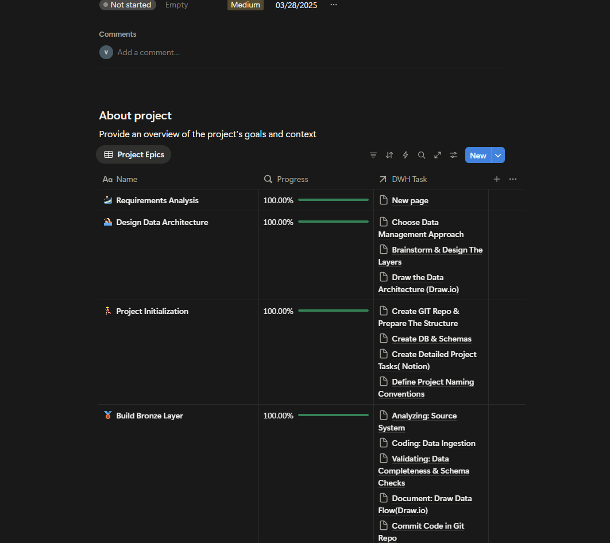

# SQL-data-warehouse-Project1

Building a modern data warehouse with SQL Server, including ETL process, data modelling and analytics.

## Data Architecture

The data architecture for this project follows Medallion Architecture **Bronze**, **Silver**, and **Gold** layers:

1. **Bronze Layer**: Stores raw data as-is from the source systems. Data is ingested from CSV Files into SQL Server Database.
2. **Silver Layer**: This layer includes data cleansing, standardization, and normalization processes to prepare data for analysis.
3. **Gold Layer**: Houses business-ready data modeled into a star schema required for reporting and analytics.

## Project plan
I used the application NOTION to make the plan and decided what should do when building each layer.
 [Data Warehouse planning using NOTION](https://www.notion.so/Data-Warehouse-Project-27eabb31efc380ec8878fa400fc6d609?source=copy_link).

