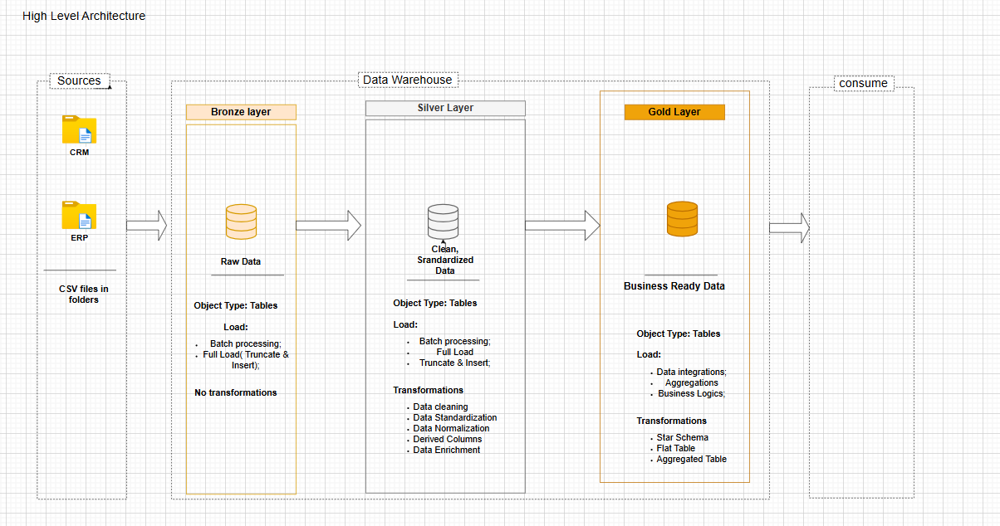
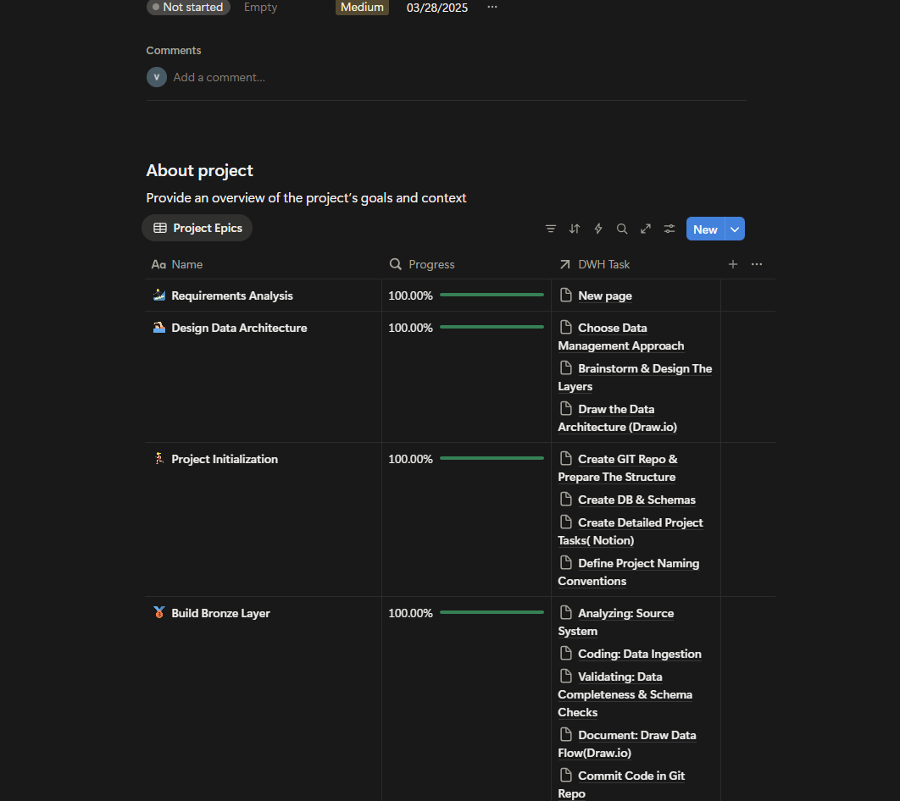

# SQL-data-warehouse-Project1

Building a modern data warehouse with SQL Server, including ETL process, data modelling and analytics.

## Data Architecture

The data architecture for this project follows Medallion Architecture **Bronze**, **Silver**, and **Gold** layers:

1. **Bronze Layer**: Stores raw data as-is from the source systems. Data is ingested from CSV Files into SQL Server Database.
2. **Silver Layer**: This layer includes data cleansing, standardization, and normalization processes to prepare data for analysis.
3. **Gold Layer**: Houses business-ready data modeled into a star schema required for reporting and analytics.

## Project plan
I used the application NOTION to make the plan and decided what should do when building each layer.
 [Data Warehouse planning using NOTION](https://www.notion.so/Data-Warehouse-Project-27eabb31efc380ec8878fa400fc6d609?source=copy_link).

## Bronze layer

1. Created Bronze Tables    
Six tables were created, and the number is same as those from the original source; The corresponding scripts could be referenced the file named ddl_bronze.sql in the bronze folder;  

2. Load the data from original source, two csv files, including six tables loaded without change.

2. Cleaning and transforming data
I have to check the data information and relationship before loading the data. For example some data contained space in the Bronze layer, so need to use trim function to get rid of it. Some entries contained the duplicate items and I had to tell which entry should be left and which one should be deleted. For the relationship part, I used the application called draw,io to make their relationship to clear before cleaning. 

